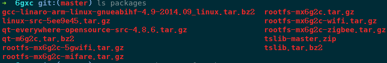

Form ZLG(EPC_IoT_M6GxC_A6GxC-V1.05.00)
---



### Start docker

- Build by self

```bash
$ docker build -t 6gxc .
$ docker run --rm -it -v `pwd`:/workspace 6gxc:latest
```

- From `https://hub.docker.com`

```bash
$ docker run --rm -it -v `pwd`:/workspace chonglou/6gxc:latest
```

### build for yourself toolchain

```bash
> cd ~/build/buildroot-2019.02
> make menuconfig 
> make -j
```

will generate `output/images/rootfs.tar.gz`, and run `tar zcvf kernel.tar.gz arch/arm/boot/zImage` to package 

### Build kernel 

```bash
> cd ~/build/A7-linux-src
> ./built-zImage.sh CHANGE-ME
> 
```

- dts file is in `arch/arm/boot/dts`

### Document

- [Buildroot](https://buildroot.org/downloads/manual/manual.html)
- [Linaro](https://www.linaro.org/downloads/)
- [eLinux Toolchains](https://elinux.org/Toolchains)
- [musl.cc](https://musl.cc/)
